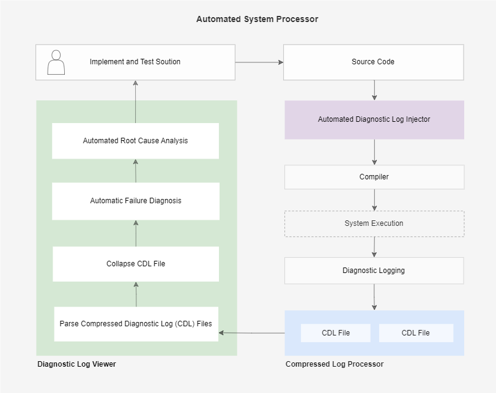

# ASP
Automted System Processor (ASP) is a free fully automated log based diagnostic solution for software systems. See this section for more information on how it works.

> [!NOTE]  
> This repo is in development. The usage section of this repo will be updated when all the necessary features are packaged into the application. 

# Usage
To run this program, run the following command:
  ```shell
  python3 server.py
  ```
This will start a websocket server on port 8765. After connecting to the websocket server, you can send commands to interface with the system processor. 

# How does it work?

At its core, ASP leverages a new kind of logging called Diagnostic Logging to achieve its functionality. Diagnostic logging is a process in which the instructions, variables and exceptions of a program are logged. Unlike traditional logging which logs information that have to be aggregated to provide diagnostic and analytical insight, with diagnostic logging, the program itself becomes the diagnostic and analytics tool. This results in a fully automated log based diagnostic solution that can perform automated root cause analysis.

Practically, there are two issues which hinder the use of diagnostic logging. The size of the generated logs and the overhead incurred when logging the variables within the program itself.

To address the issue of log file size, ASP leverages a free log management tool named Compressed Log Processor(CLP), which is a tool capable of compressing logs and searching the compressed logs without decompression. CLP provides libraries to efficiently compress the log files into an intermediate representation format and to further compress the log when it is archived. CLP applies data specific compression to the logged data and exploits any repetitiveness to improve its compression.

A system diagram is provided below:



## Automated Diagnostic Log Injector

The Automated Diagnostic Log Injector (ADLI) tool is used to inject logs needed to capture the diagnostic information from the program. It uses Abstract Syntax Tree's (AST) to traverse the program and identify executed instructions and the corresponding variables. The log file that is generated by running programs with diagnostic logs injected in them is called a Compressed Diagnostic Log (CDL). 

## Statments, Variables and Exceptions

The header of the CDL file contains the source code for the executed program. It also contains a logtype map and a variable map. The log type map maps every executed statement in the program to an ID and saves the line number in the source code. When logging statements, the logtype id is used in place of the syntax, reducing the overhead to log. The variable map maps every variable that was logged and saves the variable name, lineno and column number in the source code. 

The body of the CDL file contains the execution sequence of the program. Using this information, the CDL file can be used to extract the call stack and variables for any given position in the program. The diagnostic log viewer is an open source tool which can be used to view CDL files.

Note: In a coming update, logtype map will be replaced with statement map to better reflect the data it holds. 

Example:
For example, if the ADLI tool encounters a statement such as `var1 = var2 + var3`, it will add the statement to a logtype map saved in the header of the CDL file and assigned it an ID, called log type id. It will also recognize var1 as a variable which needs to be logged and adds it to the variable map in the header of the CDL file. When logging this line of code, the logging overhead is reduce because the logtype map id will be used instead of the full syntax. 

So in this example, the injected logs are provided below (where <logtypeid> and <varid> are placeholders).
```
logger.info(<logtypeid>)
var1 = var2 + var3
logger.info(f"# <varid> {var1})
```

In addition to logging variables and instructions, the ADLI tool also injects logs which captures any exceptions that were thrown. When the CDL file is parsed, the exception can be aligned with statement which caused the exception. It will also be possible inspect the call stack and variables at the point of failure. 

## System Identification

A software system is a group of programs working together to achieve a given function. When injecting logs into the programs in the system, the ADLI tool also includes system level information in the header of the CDL file. This includes the system the program belongs to and the version of the system. Using this information is used by ASP to fully recreate the system using the log files. 


## Automated System Processor


## Assembling Systems

## Extracting System Level Traces

## Automated Root Cause Analysis

## Automated System Viewer

