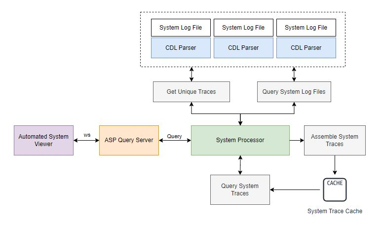

# ASP-QUERY-SERVER
This websocket server handles queries from the Automated System Viewer to extract and filter through system level traces. 

> [!NOTE]  
> This repo is in development and there are core features being added and explored.

# Usage
Currently, each program has to be run separately. This workflow will be automated once core functionality is fully developed.

To run the query handler, go to components/query_handler and run:
  ```shell
  python3 server.py
  ```
This will start a websocket server on port 8765. After connecting to the websocket server, you can send commands to interface with the system processor. 

Note: As of PR #22, the query server is not connected to a data source. In the coming PR's, the query server will be connected to the database.

To run the system processor, go to components/asp and run:
  ```shell
  python3 SystemProcessor.py
  ```
This will generate a traceEvents.json file in the directory where the program was executed from.

# System Diagram


# How does it work?

This section is in development because the information it had was outdated.

In the mean time, please see these PR's for some more insight:
[PR #22](https://github.com/vishalpalaniappan/asp-query-server/pull/22)
[PR #23](https://github.com/vishalpalaniappan/asp-query-server/pull/23),
[PR #25](https://github.com/vishalpalaniappan/asp-query-server/pull/25), 

## Queries
Coming soon

In the current version of this program, the sample_system_logs folder contains all the log files belonging to the current system. In the future, once CDL log files are ingested by CLP, the features CLP provides will be used to improve the performance of this system.
