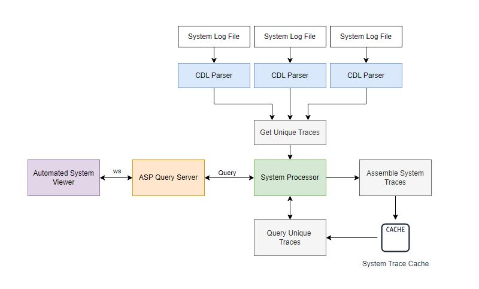

# asp-query-server
This websocket server handles queries from the Automated System Viewer to extract and filter through system level traces. 

> [!NOTE]  
> This repo is in development and there are core features being added.

How does it work? 

On a high level, it does the following (some features are in development):

- The SystemProcessor class identifies all the log files which belong to the system (currently, they are in a known folder).
- It then uses the Cdl class to extract the program execution data from each log file and gathers the unique traces from each program. 
- It then processes each unique trace and assembles them in the order they appear.
- It groups unique traces if they start and end at the same location, these traces have the same **Trace Type**.
- It then allows the traces to be queried by timestamp, specific variable value or by UID (this will evolve)
    - I think that as this evolves, for a given trace type, there are specific variables associated with it, it would be great to allow the user to select the variable and search for traces with a particular value.

The Cdl class uses the clp-ffi-py library to decode the CDL file and extracts the program execution data, such as:
- Execution Sequence
- Call stack
- Variable Stack
- Exception Information
- Unique Traces

In the current version of this program, the sample_system_logs folder contains all the log files belonging to the current system. In the future, once CDL log files are ingested by CLP, the features CLP provides will be used to improve the performance of this system.
